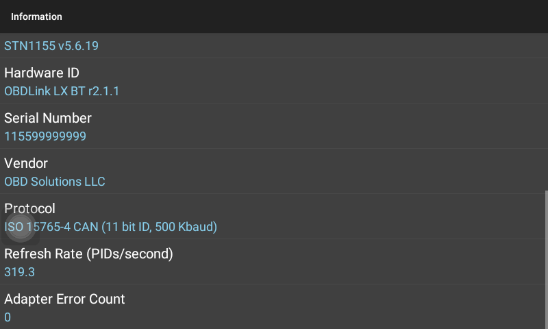
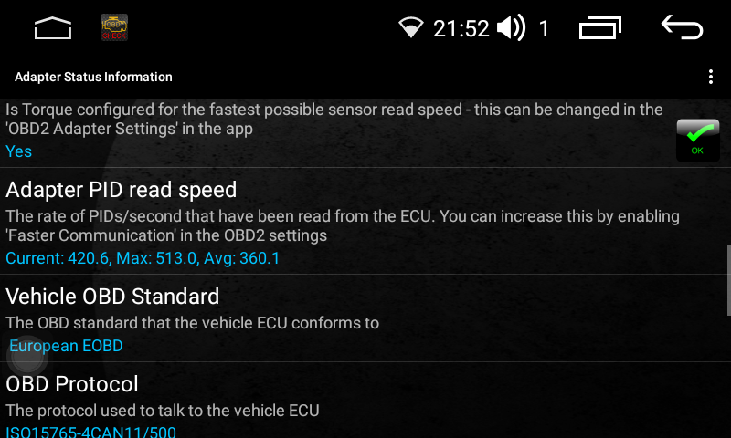
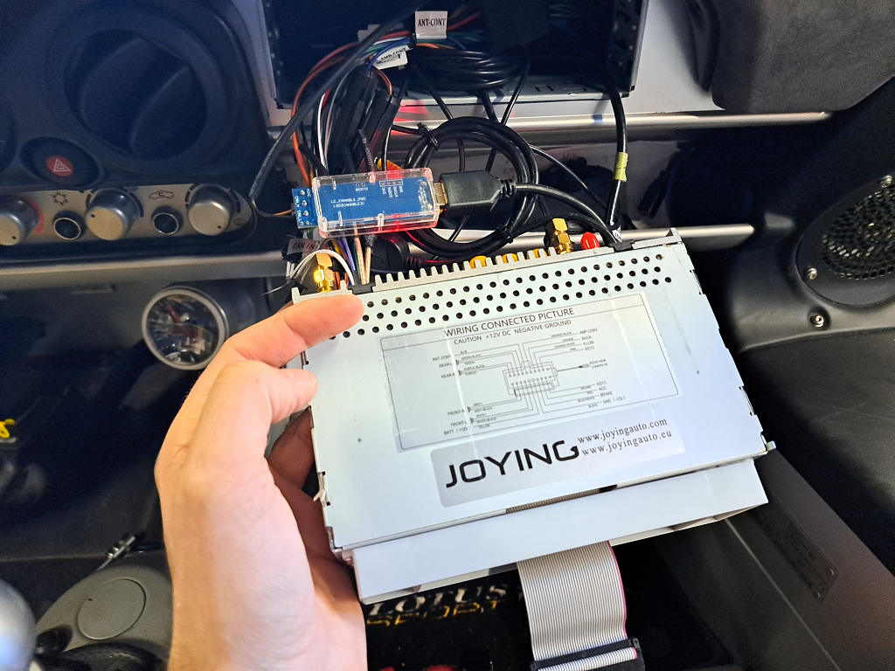

# CANable SLCAN to ELM327 Bridge

Android application that binds an USB CANable adapter to an ELM327 Application.

Connect a USB CANable adapter to the USB OTG port of your Android device. Start this app and connect to it using an ELM327 client, such as [OBDFusion](https://play.google.com/store/apps/details?id=OCTech.Mobile.Applications.TouchScan) or [Torque](https://play.google.com/store/apps/details?id=org.prowl.torque).

Configure the OBD application as you would with a WiFi ELM327, using the port 127.0.0.1 if on the same Android device.

This application can achieve speeds of over 300 PIDs/second, making it faster than the OBDLink SX adapter, which is supposed to be the fastest adapter.





The ELM327 emulation is based on the OBDLink LX.

This application is derived from [usb-serial-telnet-server](https://github.com/ClusterM/usb-serial-telnet-server).

## My setup

I've connected the CANable behind a Joying 6.2 headunit.



## Compatibility

 - Only for CAN-Bus based car (No K-Line Support).
 - Only for SLCAN based CAN-Bus adapter.

## Use the SLCAN over NET

### With a Linux client

```
socat -d -d TCP:192.168.xxx.yyy:4444 PTY,link=/tmp/slcan,raw,echo=0
slcan_attach -o -c /tmp/slcan
ip link set slcan0 up
```

### Python-can

Select "slcan" interface and put "socket://192.168.xxx.yyy:4444" as device.

## FAQ

**Q: Wouldn't it be better to have a modified firmware for CANable with the ELM327 emulation in it?**

**A:** Most OBD application (not all), only have driver implementation for the FTDI chip and not for the CANable CDC ACM.

**Q: Why not use the Candlelight instead of the slcan Firmware?**

**A:** It would be probably better to use the Candlelight Firmware, but an implementation for the gs_usb on Android has to be done.

**Q: My device is not detected?**

**A:** Ensure that you have the [slcan firmware](https://canable.io/updater/) on it.

**Q: Waren't you happy with the OBDLink LX adapter?**

**A:** I'am using a Joying 6.2 Headunit in my car, and I coundn't achieve more than 18 PIDs/second. I suspect the bluetooth stack is very poor.

**Q: How do I prevent the Joying Head Unit from terminating the service when going into deep sleep (turning key off)?**

**A:** You need to add the application to the file "/oem/app/skipkillapp.prop" file. See "JoyingUpdate.zip" file.
