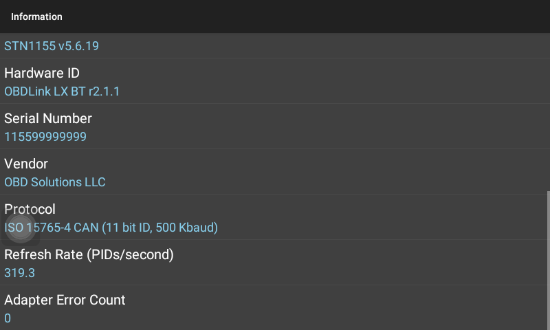
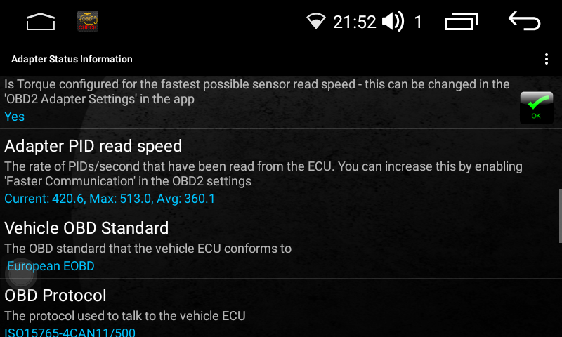
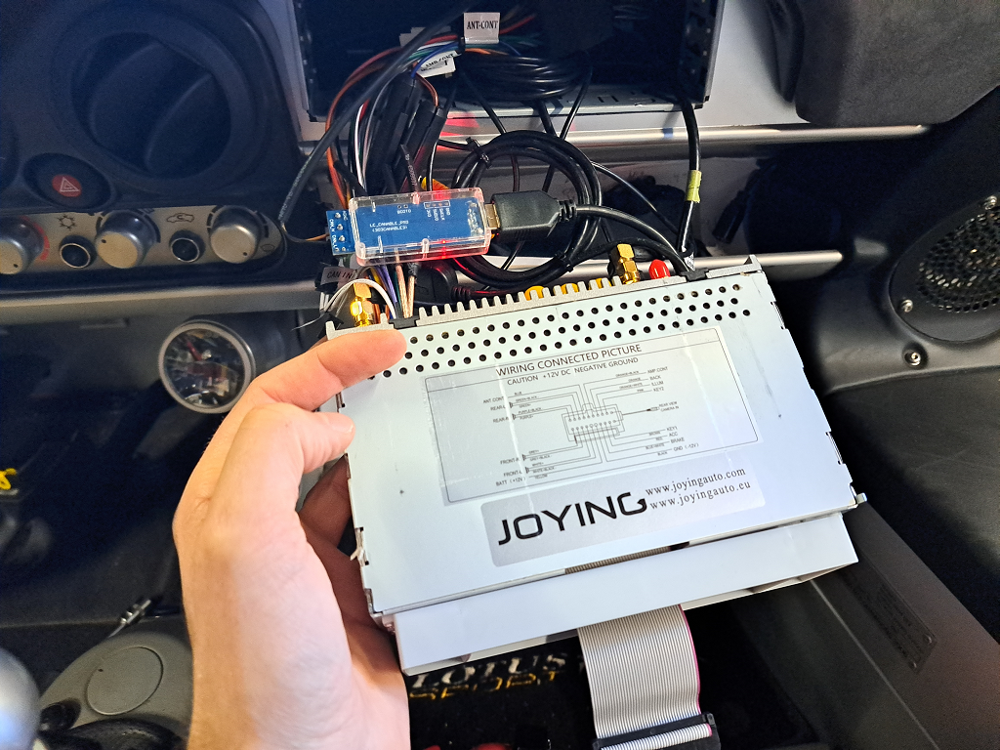

# USB CAN to ELM327 Bridge

Android application that binds a USB CAN adapter to an ELM327 Application.

Connect a USB CAN adapter to the USB OTG port of your Android device. Start this app and connect to it using an ELM327 client, such as [OBDFusion](https://play.google.com/store/apps/details?id=OCTech.Mobile.Applications.TouchScan) or [Torque](https://play.google.com/store/apps/details?id=org.prowl.torque).

Configure the OBD application as you would with a WiFi ELM327, using the port 127.0.0.1 if on the same Android device.

This application can achieve speeds of over 300 PIDs/second, making it faster than the OBDLink SX adapter, which is supposed to be the fastest adapter.





The ELM327 emulation is based on the OBDLink LX.

This application is derived from [usb-serial-telnet-server](https://github.com/ClusterM/usb-serial-telnet-server).

## My setup

I've connected the CANable behind a Joying 6.2 headunit.



## Compatibility

 - Only for CAN-Bus based car (No K-Line Support).
 - The adapter is driven by the [androidCAN](https://github.com/Alcantor/androidCAN) library, which speaks
   the candleLight/gs_usb and 8devices/usb_8dev protocols natively over the
   Android USB Host API - no SLCAN serial firmware needed. Supported adapters are
   whatever is listed in `GsUsb.SUPPORTED_DEVICES` and `Usb8Dev.SUPPORTED_DEVICES`.
 - **8devices/usb_8dev** - the [Korlan USB2CAN](https://www.8devices.com/products/korlan).
 - **candleLight/gs_usb** - the CANable and its variants, which are well explained on
   [Elmue's CANable Firmware Update](https://netcult.ch/elmue/CANable%20Firmware%20Update)
   page; an improved firmware can be installed from there if necessary.

## Building

The [androidCAN](https://github.com/Alcantor/androidCAN) library is a submodule, so clone with it:

```
git clone --recurse-submodules https://github.com/Alcantor/usb-slcan-elm327-server.git
```

(or `git submodule update --init` in an existing clone - without it the library
directory is empty and Gradle cannot configure the build).

Then `./gradlew :app:assembleDebug` (needs `sdk.dir` in `local.properties`).

To build something installable, put the signing key in a `keystore.properties`
next to `settings.gradle` - it is gitignored, and without it the release build
is left unsigned rather than failing:

```
storeFile=/path/to/upload-keystore.jks
storePassword=...
keyAlias=...
keyPassword=...
```

`./gradlew :app:assembleRelease` then writes a signed
`app/build/outputs/apk/release/can2elm327-v<version>-release.apk`.

## Use the CAN bus over the network

The bus is tunnelled with the
[cannelloni](https://github.com/mguentner/cannelloni) protocol over **TCP**,
which replaced the older SLCAN-over-TCP server. The app is the cannelloni
*server*: it listens on **Cannelloni listen port** (20000 by default) and the
client dials in. One client at a time: the server handles a single connection,
and a second one waits until the first disconnects. Fanning the bus out to
several tools at once would be useful, it is simply not implemented.

Note that cannelloni's TCP mode is not the same framing as its UDP mode: the
connection opens with a `CANNELLONIv1` handshake in both directions and then
streams frames back to back, with none of the `version/op_code/seq_no/count`
packet header that UDP datagrams carry.

### With a Linux client

```
sudo ip link add name can0 type vcan
sudo ip link set can0 up
cannelloni -I can0 -C c -R 192.168.xxx.yyy -r 20000
```

`-C c` is what selects TCP client mode; point `-R` at the Android device.
`candump can0` / `cansend can0 7DF#0201050000000000` then work as usual.

### Python-can

[`can-cannelloni`](https://pypi.org/project/can-cannelloni/) is a python-can
backend that speaks this protocol, so a Python program can talk to the app
directly - no `cannelloni` binary and no `vcan` in between:

```python
import can

bus = can.Bus(interface="cannelloni", channel="192.168.xxx.yyy:20000")
bus.send(can.Message(arbitration_id=0x7DF, data=b"\x02\x01\x05"))
print(bus.recv(1.0))
```

Failing that, point python-can's "socketcan" interface at the `can0` that the
`cannelloni` client above bridges.

## FAQ

**Q: Wouldn't it be better to have a modified firmware for CANable with the ELM327 emulation in it?**

**A:** Most OBD application (not all), only have driver implementation for the FTDI chip and not for the CANable CDC ACM.

**Q: Why not use the Candlelight instead of the slcan Firmware?**

**A:** That is exactly what this version does - the gs_usb implementation for Android now exists, in the [androidCAN](https://github.com/Alcantor/androidCAN) library.

**Q: My device is not detected?**

**A:** Check that its USB vendor/product ID is in the androidCAN supported-device
tables, and mirrored in `app/src/main/res/xml/usb_device_filter.xml`.

**Q: Waren't you happy with the OBDLink LX adapter?**

**A:** I'am using a Joying 6.2 Headunit in my car, and I coundn't achieve more than 18 PIDs/second. I suspect the bluetooth stack is very poor.

**Q: How do I prevent the Joying Head Unit from terminating the service when going into deep sleep (turning key off)?**

**A:** You need to add the application to the file "/oem/app/skipkillapp.prop" file. See "JoyingUpdate.zip" file.

